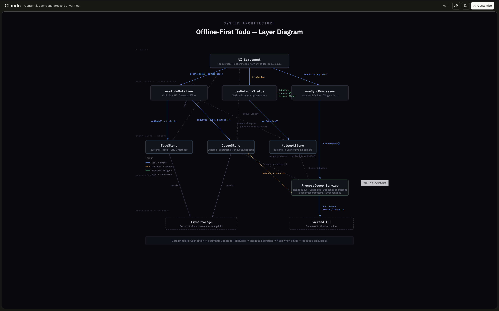

# High Performance Feed

A performance-optimized feed featuring cursor pagination, optimistic updates via the React Query cache, smooth scrolling, and debounced search. Even with a large dataset, it renders smoothly at 60 FPS, recycling a pool of containers instead of mounting new components.

## Architecture



To handle a large dataset, the client receives paginated data to limit how many items are stored in memory at once. The server is simulated with Mirage.js and uses cursor-based pagination: it caps the number of items returned per request and includes the index of the last item in the response. The client uses that index to determine where the next fetch should start, reducing traversal time because the server doesn't need to count through preceding rows. The server also uses a deterministic data generator to create 10,000 items to test the application under realistic load.

The `useFetchPosts` hook handles the paginated responses by tracking the cursor index with `pageParams`. It determines whether the current page is the last by checking whether a cursor exists and, if it does, setting `pageParams` accordingly. If no cursor exists, `getNextPageParam` returns `undefined`, telling React Query there are no more pages to fetch. React Query manages this flow and stores the data in its cache so multiple components can read from a single source instead of triggering multiple fetches. Mutations are handled by `usePostMutations`, which writes to the cache optimistically via `onMutate` without waiting for the server response and rolls back changes via `onError` if the request fails.

The list component is optimized for smooth scrolling by recycling components, reducing the load on the JS thread because it avoids mounting and unmounting components — which are expensive JS thread operations. As the user approaches the end of the list, a 70% threshold triggers fetching the next page, with a loading spinner to indicate progress. On initial render, while data is being fetched, animated skeleton loaders make the app feel faster; once loaded, the PostCard renders and triggers like and unlike mutations, updating the cache optimistically.

Specific posts can also be searched and filtered by category. Keyword search is optimized with debouncing to avoid sending an API request on every keystroke: after a 500ms delay, the search keyword is updated and passed to the list component, which then requests data based on the keyword or category.

## Installation

### Prerequisites

- Node.js v22 or higher

### Install dependencies

```bash
npm install
```

### Run the project

This project uses Expo and works with both Expo Go and development builds:

```bash
npx expo start
```

## What I Learned

- **Cursor-Based Pagination** — Building `useFetchPosts` taught me how to handle paginated data on the client with `pageParams` — the cursor returned by each response that tells the next fetch where to start. `getNextPageParam` sets the next page or returns `undefined` when there are no more pages to fetch.

- **List Optimization** — I learned list optimization strategies using FlatList, then swapped FlatList for FlashList for smoother rendering. FlatList mounts and unmounts components as new items are introduced, while FlashList reuses a fixed number of containers and updates props to render new items.

- **Server-Side State & Cache Manipulation** — Building the hooks taught me about React Query's in-memory cache. I learned that query keys (and changes to them) trigger a refetch of fresh data, and I learned to use `onMutate` to update the cache before the server responds and `onError` to roll back if it fails.

## Known Limitations

This project uses Mirage.js as a simulated server. Real-world performance characteristics would differ with actual network latency and server response times.

## Tech Stack

- React Native (Expo)
- Expo Router
- React Query (TanStack)
- FlashList
- Mirage.js
- Moti (Skeleton animations)

## License

MIT